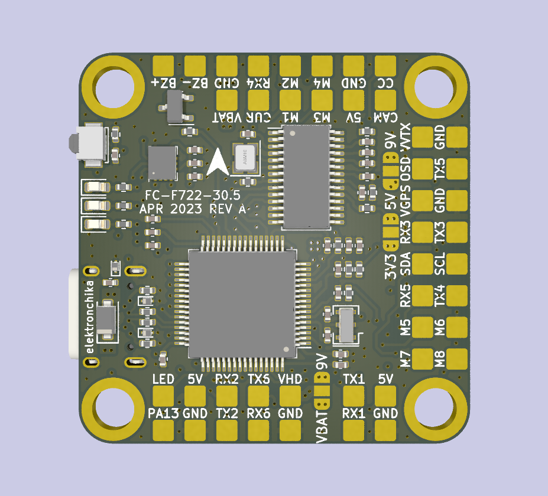

# FLY HIGH

A place for RC drone, airplane and car electronics

## Fly High F722 Flight Controller

### Pictures

Top View

Bottom View

### Specifications

- Input voltage: 2S to 6S
- Microcontroller: STM32F722
- Power Supplies:
	- 5 V @ 2.5 A
	- 9 V @ 3 A, controlled from PINIO
	- 3.3 V @ 500 mA
- Accelerometer and gyro: ICM-42688-P
- Barometer: BMP280 barometer
- Connectors: GPS and compass, camera, HD VTX, analog VTX, Buzzer, LED strips
- Blackbox: 128 MB SD card chip onboard
- Configuration: USB type C and DFU button
- LEDs: power (red); BF (blue and green)
- Size: 37.0 × 37.0 mm with 30.5 × 30.5 mm mounting holes
